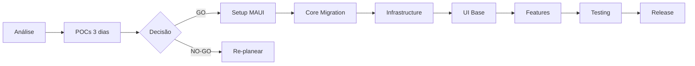

# 📱 tabApp - Migração Xamarin.Android → .NET MAUI

## 🎯 Visão Geral

Este repositório contém a **análise completa e backlog estruturado** para migração da aplicação **tabApp.Droid** (Xamarin.Android) para **.NET MAUI** (tabApp.CrossPlatform).

### Status Atual
- ✅ **Análise Completa:** Concluída
- ✅ **Backlog Gerado:** 127 Issues prontas
- ⏭ **Próximo Passo:** Fase 0 - POCs Críticos

---

## 📚 Documentação Gerada

### 1. 🎯 [EXECUTIVE_SUMMARY.md](./EXECUTIVE_SUMMARY.md) - **LEIA PRIMEIRO**
**Audiência:** Management, Stakeholders, Decision Makers  
**Conteúdo:**
- Resumo executivo da análise
- Timeline: 8 meses (165 dias)
- Estimativa de recursos: 1-2 developers
- Riscos e mitigações
- Recomendação: ✅ **GO** (com condições)
- Critérios de decisão Go/No-Go

👉 **Use para:** Apresentação ao management e aprovação de budget

---

### 2. 📊 [MIGRATION_ANALYSIS_REPORT.md](./MIGRATION_ANALYSIS_REPORT.md)
**Audiência:** Tech Leads, Architects, Developers  
**Conteúdo:**
- Análise técnica completa do projeto
- Inventário de componentes (~300 items)
- Arquitetura atual (Activities, Fragments, Services)
- Análise de dependências (NuGet packages)
- Identificação de riscos técnicos
- Estratégia de migração detalhada

**Estatísticas:**
- 1 Activity (MainActivity)
- 51 Fragments
- 42 Adapters
- 92 XML Layouts
- 47 ViewModels
- 96 Services
- 16 Models

👉 **Use para:** Entender a complexidade técnica completa

---

### 3. 🎫 [MIGRATION_BACKLOG_GITHUB_ISSUES.md](./MIGRATION_BACKLOG_GITHUB_ISSUES.md)
**Audiência:** Developers, Scrum Masters, Project Managers  
**Conteúdo:**
- **127 GitHub Issues** prontas para criar
- **8 Milestones** organizados
- Priorização: P0 (32), P1 (55), P2 (40)
- Classificação de risco
- Definition of Done para cada issue
- Dependencies mapeadas

**Milestones:**
```
M0: Assessment & Planning          →  5 issues |  3 dias
M1: MAUI Base Setup                →  8 issues |  5 dias
M2: Core Layer Migration           → 25 issues | 15 dias
M3: Infrastructure Migration       → 15 issues | 20 dias
M4: UI Base & Navigation           → 12 issues | 10 dias
M5: Feature Migration - Phase 1    → 35 issues | 52 dias
M6: Feature Migration - Phase 2    → 20 issues | 40 dias
M7: Testing & Release              →  7 issues | 20 dias
──────────────────────────────────────────────────────
TOTAL                              → 127 issues | 165 dias
```

👉 **Use para:** Criar backlog no GitHub Projects ou Azure DevOps

---

### 4. 🚀 [QUICK_START_GUIDE.md](./QUICK_START_GUIDE.md)
**Audiência:** Developers começando a migração  
**Conteúdo:**
- Como começar imediatamente
- Checklist de pré-requisitos
- Fase 0: Assessment (3 dias)
- Ferramentas necessárias
- Recursos de aprendizagem
- Red flags - quando parar
- FAQ

👉 **Use para:** Onboarding de developers no projeto

---

### 5. 🧪 [POC_VALIDATION_TEMPLATES.md](./POC_VALIDATION_TEMPLATES.md)
**Audiência:** Developers executando POCs  
**Conteúdo:**
- Template de código para POC #1: Background Location
- Template de código para POC #2: Bluetooth
- Template de código para POC #3: Maps
- Checklists de teste
- Critérios de sucesso
- Matriz de decisão

👉 **Use para:** Executar e validar POCs críticos nos primeiros 3 dias

---

## 🚦 Roadmap de Migração



### Timeline Detalhada

```
┌───────────────────────────────────────────────────────────────┐
│ MÊS 1-2: Foundation                                           │
├───────────────────────────────────────────────────────────────┤
│ Semana 1-2   │ POCs + Assessment                              │
│ Semana 3-4   │ MAUI Setup + DI + Navigation                   │
│ Semana 5-8   │ ViewModels (47) + Core Services               │
├───────────────────────────────────────────────────────────────┤
│ MÊS 3-4: Infrastructure                                       │
├───────────────────────────────────────────────────────────────┤
│ Semana 9-12  │ GPS, Bluetooth, Maps, Notifications           │
│ Semana 13-16 │ UI Base, CollectionViews, Templates           │
├───────────────────────────────────────────────────────────────┤
│ MÊS 5-7: Features                                             │
├───────────────────────────────────────────────────────────────┤
│ Semana 17-20 │ Home, Login, Settings                          │
│ Semana 21-24 │ Cliente Module (mais complexo)                 │
│ Semana 25-26 │ Pedidos Module                                 │
│ Semana 27-28 │ Faturação + Gestão                             │
├───────────────────────────────────────────────────────────────┤
│ MÊS 8: Release                                                │
├───────────────────────────────────────────────────────────────┤
│ Semana 29-30 │ Integration Testing                            │
│ Semana 31    │ Beta Rollout                                   │
│ Semana 32    │ Production Release                             │
└───────────────────────────────────────────────────────────────┘
```

---

## ⚠️ Componentes Críticos

### 🔴 Alto Risco

1. **ForegroundService GPS Tracking**
   - **Função:** Tracking contínuo de GPS durante entregas
   - **Risco:** MAUI pode ter limitações em background tasks
   - **Mitigação:** POC obrigatório, considerar Shiny.Locations
   - **Issue:** #65

2. **Bluetooth Synchronization**
   - **Função:** Sync entre dispositivos via Bluetooth
   - **Risco:** Plugin.BLE pode ter limitações
   - **Mitigação:** POC com devices reais, fallback para WebAPI
   - **Issue:** #66

3. **MvvmCross → MAUI MVVM**
   - **Função:** Mudança completa de framework
   - **Risco:** Breaking changes em toda navegação
   - **Mitigação:** Migração incremental, testes unitários
   - **Issues:** #14-62

### ⚠️ Médio Risco

4. **Google Maps Integration**
   - **Issue:** #67
   
5. **Bluetooth Printing**
   - **Issue:** #71

6. **42 Adapters → CollectionView Templates**
   - **Issues:** #80, vários

---

## 📊 Métricas do Projeto

### Complexidade
```
Total de Linhas de Código (estimado):
- tabApp.Droid:  ~50,000 linhas
- tabApp.Core:   ~30,000 linhas
- Total:         ~80,000 linhas
```

### Distribuição de Trabalho
```
Core Migration:       20% (33 dias)
Infrastructure:       12% (20 dias)
UI Migration:         56% (92 dias)
Testing & Release:    12% (20 dias)
```

### Risco por Milestone
```
M0: Assessment         🟡 Médio   (POCs podem falhar)
M1: MAUI Setup         🟢 Baixo
M2: Core Migration     🟡 Médio   (Volume elevado)
M3: Infrastructure     🔴 Alto    (GPS, BT críticos)
M4: UI Base            🟡 Médio
M5-M6: Features        🟠 Médio-Alto (Complexidade UI)
M7: Testing            🔴 Alto    (Descoberta de bugs)
```

---

## 🎯 Próximos Passos Imediatos

### 1️⃣ Aprovação (1 dia)
- [ ] Apresentar [EXECUTIVE_SUMMARY.md](./EXECUTIVE_SUMMARY.md) ao management
- [ ] Obter aprovação de budget (8 meses, 1-2 developers)
- [ ] Confirmar disponibilidade de equipa
- [ ] Definir data de início

### 2️⃣ Setup Ambiente (1 dia)
- [ ] Instalar Visual Studio 2022 (17.8+)
- [ ] Instalar .NET 10 SDK
- [ ] Configurar emuladores Android
- [ ] Configurar dispositivos físicos de teste
- [ ] Configurar acesso ao repositório

### 3️⃣ Fase 0: POCs (3 dias) - **CRÍTICO**
- [ ] POC #1: Background Location Tracking (1 dia)
- [ ] POC #2: Bluetooth Communication (1 dia)
- [ ] POC #3: Maps Integration (1 dia)
- [ ] Preencher [POC Decision Matrix](./POC_VALIDATION_TEMPLATES.md#-overall-poc-decision-matrix)

### 4️⃣ Decisão Go/No-Go
- [ ] ✅ Se todos POCs passarem → **GO para Issue #6**
- [ ] ⚠️ Se 1-2 POCs falharem → **GO COM RESSALVAS**
- [ ] 🛑 Se todos falharem → **NO-GO, re-avaliar**

### 5️⃣ Início da Migração (se GO)
- [ ] Criar branch `feature/maui-migration`
- [ ] Começar Issue #6: Create MAUI Solution Structure
- [ ] Setup CI/CD pipeline
- [ ] Primeira build MAUI funcional

---

## 🛠 Ferramentas Requeridas

### Desenvolvimento
- [x] Visual Studio 2022 (17.8+) ou Rider
- [x] .NET 10 SDK
- [x] Android SDK (API 21-34)
- [x] Git + GitHub

### Testing
- [ ] Android Emulator (API 30+)
- [ ] Dispositivos físicos Android (pelo menos 2)
- [ ] Impressora Bluetooth (para testes)
- [ ] GPS Simulator

### CI/CD
- [ ] GitHub Actions / Azure DevOps
- [ ] App Center (já configurado)
- [ ] Keystore para signing (já existe)

---

## 📞 Contactos e Recursos

### Documentação Oficial
- [.NET MAUI Docs](https://learn.microsoft.com/dotnet/maui/)
- [Xamarin to MAUI Migration](https://learn.microsoft.com/dotnet/maui/migration/)
- [CommunityToolkit.Maui](https://github.com/CommunityToolkit/Maui)

### Plugins Críticos
- [Plugin.BLE](https://github.com/xabre/xamarin-bluetooth-le) - Bluetooth
- [Microsoft.Maui.Controls.Maps](https://learn.microsoft.com/dotnet/maui/user-interface/controls/map) - Maps
- [Shiny](https://github.com/shinyorg/shiny) - Background Tasks (se necessário)

### Comunidade
- [.NET MAUI Discord](https://aka.ms/dotnet-discord)
- [Stack Overflow - .NET MAUI](https://stackoverflow.com/questions/tagged/maui)

---

## 📈 Success Metrics

### Code Quality
- **Test Coverage:** Target >70%
- **Build Success Rate:** >95%
- **Code Review:** 100% reviewed

### Performance
- **App Startup:** <3s (vs. ~2s Xamarin)
- **List Scrolling:** 60 FPS
- **Battery (GPS active):** <8%/hora

### Business
- **Feature Parity:** 100%
- **Crash-free Rate:** >99%
- **User Satisfaction:** >4.5/5

---

## ❓ FAQ

**P: Por que migrar se Xamarin.Android ainda funciona?**  
R: Xamarin.Android **support ended** em Maio 2024. Sem atualizações de segurança ou compatibilidade com Android futuro.

**P: Posso fazer a migração gradualmente em produção?**  
R: Não recomendado. Melhor fazer em paralelo e fazer switch completo após validação.

**P: Quanto tempo até primeira versão funcional?**  
R: ~2-3 semanas para build básico com login. 8 meses para feature parity completa.

**P: E se os POCs falharem?**  
R: Existem fallbacks (plugins alternativos, implementações nativas), mas aumenta complexidade e risco.

**P: Posso adicionar iOS depois?**  
R: Sim! Código MAUI é 95% compartilhado. iOS seria +2-3 semanas após Android estar estável.

---

## 🎉 Conclusão

Esta análise fornece um **roadmap completo e executável** para migração bem-sucedida de tabApp para .NET MAUI.

### Recomendação Final: ✅ **GO**

**Justificação:**
1. Xamarin está obsoleto → Migração é inevitável
2. POCs validarão viabilidade técnica em 3 dias
3. Backlog estruturado reduz risco de execução
4. Benefícios de cross-platform justificam investimento
5. Timeline de 8 meses é realista e conservador

### Próxima Ação: 
```bash
# Executar POCs (3 dias)
git checkout -b poc/critical-features
# Ver POC_VALIDATION_TEMPLATES.md para código
```

---

**Análise realizada:** 2026-02-18  
**PM Agent:** MAUI Migration Orchestrator  
**Status:** ✅ Pronto para Executar  
**Aprovação:** _Pending_

---

## 📄 Índice de Documentos

1. **Este README** - Overview e navegação
2. [EXECUTIVE_SUMMARY.md](./EXECUTIVE_SUMMARY.md) - Para management
3. [MIGRATION_ANALYSIS_REPORT.md](./MIGRATION_ANALYSIS_REPORT.md) - Análise técnica
4. [MIGRATION_BACKLOG_GITHUB_ISSUES.md](./MIGRATION_BACKLOG_GITHUB_ISSUES.md) - 127 Issues
5. [QUICK_START_GUIDE.md](./QUICK_START_GUIDE.md) - Como começar
6. [POC_VALIDATION_TEMPLATES.md](./POC_VALIDATION_TEMPLATES.md) - Templates de POC

**Boa sorte na migração! 🚀**

